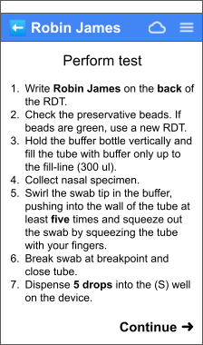
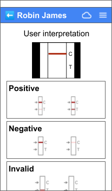

# Welcome!
This repo is intended to describe a fictional mobile app, and the ask of you is to provide an architectural design for it.

The app, codenamed “Mercury”, will be used by volunteer health workers to help conduct and capture the results of various kinds of tests for infectious diseases. The app is expected to be deployed in various parts of the globe, with a focus on low- and middle-income countries.

# The goal
Design the basic architecture of the app, focusing on the front-end aspects, and describe it.

# Requested output
Imagine there’s a junior developer on the team that you’ll be working with to develop this app, and you’d like to describe your proposed architecture to her. How would you go about doing so?

Ideas and suggestions (feel free to use any or none):
* Develop an architectural diagram of the app (e.g. box/line diagram(s) of the main pieces with supporting descriptions)
* List out the various UX components needed along with their purpose/functionality and notable properties
* Show the overall makeup of various screens - UX components, business logic, data store, notable supporting functionality/services, etc.
* Create rough sample code for a screen 

Please have the output in electronic form, creating it with whatever tools are easiest. Photos of drawings are perfectly OK! The goal is to communicate ideas, not to judge the vehicles they're contained in.

# App workflow
A user starts the app from their device's launcher...

## Home screen

The user sees a “home” or “landing” page that shows relevant information to them. The primary purpose of this screen is to show the user any in-progress tests, and allow them to start a new one. It is comprised of:
* Any messaging from their “home base”, e.g. “Reminder: check your inventory and ask for more tests if needed!” (no need to worry about where this comes from - just consider the content dynamic and might be empty/null)
* Any system warnings such as low disk space, the need to connect to the network due to pending uploads, etc.
* A scrollable list of in-progress tests the user is conducting (if any)
   * Often it’s just one, but there may be multiple (e.g. testing multiple people in a household)
   * Shown in a “card” style
   * If there are no tests, the text "No tests are currently in-progress" is shown
   * Selecting a test will navigate the user to the last screen they saw for that test
* A command to start a new test
   * Choosing this will navigate the user to the "Patient registration" screen
* Optional consideration: a command to show a history of tests they’ve performed in the past week

## Patient registration

Upon starting a new test, a new screen appears for patient registration (the patient is the person being tested). The user enters the patient's basic information here.
* Required fields: patient first name (text), age (radio button choice)
* Optional fields: patient last name (text), phone number (masked text)
* Upon pressing “Submit”,
   * A new "test instance" is considered to be created, and is assigned the entered information
   * The user advances to the next step

## Select test type

A selection of available types of tests to perform is presented. These test types are fixed within the app (i.e. they're not dynamic).
* Each test type is shown in a “card” style, having a name and image showing what it looks like
* Choosing one advances the user to the next step, and assigns the chosen test type to the in-progress test

## Perform test

Some step-by-step instructions are presented on how to perform the test.
* These instructions might span multiple screens and the content can contain images and/or bullets. The content is dependent on the test chosen.
* The user advances to the next step by pressing “Continue”

## Capture photo

Tips for taking a good capture are presented.
* This screen has the same basic form across tests - an image showing the device and test, and some "tips"
* Content might be different for various tests, such as the image or tips
* The user advances to the next step by pressing “Continue”

## Capture screen

The capture screen is presented.
* This is a live camera view, similar to a camera app
* Upon pressing the "take photo" button,
  * A photo is taken of the test (the "capture")
  * The photo is assigned to the in-progress test
  * The user advances to the next step

## User interpretation

The interpretation screen is presented.
* The photo of the user's capture is shown for reference
* Available results for the test are presented (typically positive, negative, and invalid) in a “card” style, with example images accompanying each option.
* Choosing one advances the user to the next step, and assigns the chosen interpretation to the in-progress test

## Summary screen

The summary screen is presented.
* The user’s interpretation is shown
* Upon pressing "Submit",
   * The test data (including the photo capture) is pushed to the cloud. Offline state is allowed, with the data being queued.
   * The user returns back to the hub/landing page, with the navigation stack reset

# App “silhouette”
Status bar
* System-provided - clock, network, battery, etc.

Titlebar
* Back button (if navigation state allows)
* App name (or patient name if entered)
* File upload status (ready, uploading, offline)
* App menu with the following commands:
   * Log out
   * Go home
   * About
   * End-user license agreement
* The titlebar is not shown on certain screens (e.g. photo capture)

Body
* Content depends on the screen
* Often there's scrollable content such as title text, body text, images, form controls, etc., but can sometimes be full-page such as the capture/camera UX
* There's almost always some sort of navigation affordance - e.g. a "Continue" or "Submit" button, or card selection
    * The navigation affordance triggers business logic (if any) and navigates to the destination screen

# Architectural considerations
* Allow for component re-use where practical
* The effort to specify/build a screen is ideally relatively low. Consider something data-driven? But not required. 
* Business logic should ideally live close to where each screen is specified
* New tests and instructions can ideally be added fairly easily into the app

# Potential starting points
* What are the various UX components that could be created? What's their function and primary properties?
* How are screens specified, and how do they utilize those components?
* Where would various business logic live? What could a simple data model be?
* How would screens be wired together in terms of navigation? How could business logic, such as form validation, affect this?
* How would data (e.g. tests) be locally stored?

# Future design thoughts/considerations
* What if we wanted to allow new types of tests dynamically? What could that look like?
* Internationalization, accessibility, inclusivity
